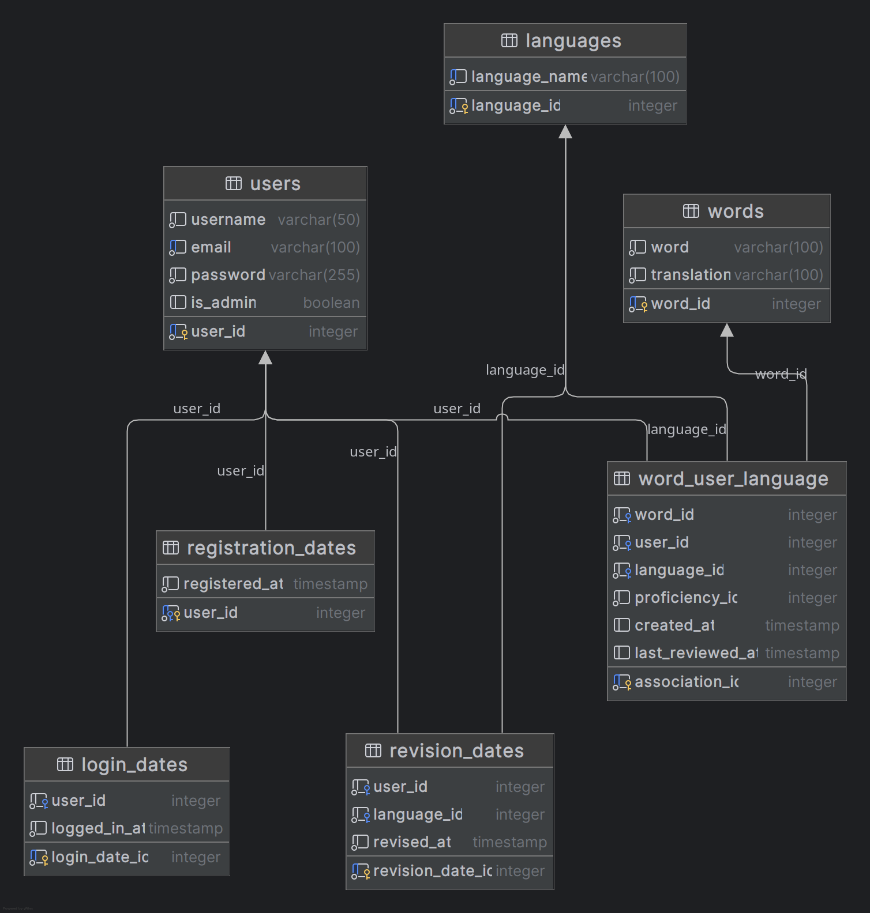

# Dokumentacja

## Baza danych
### Diagram ERD

### Tabele i ich pola
#### 1. `languages`
- **Opis:** Przechowuje dane o dostępnych językach.
- **Pola:**
  - `language_id`: Klucz główny (serial).
  - `language_name`: Nazwa języka (unikalna, niepusta).

#### 2. `users`
- **Opis:** Przechowuje dane o użytkownikach.
- **Pola:**
  - `user_id`: Klucz główny (serial).
  - `username`: Nazwa użytkownika (niepusta).
  - `email`: Adres email (unikalny, niepusty).
  - `password`: Hasło użytkownika (niepuste).
  - `is_admin`: Flaga określająca, czy użytkownik jest administratorem (domyślnie `false`).

#### 3. `words`
- **Opis:** Przechowuje dane o słówkach i ich tłumaczeniach.
- **Pola:**
  - `word_id`: Klucz główny (serial).
  - `word`: Słówko (niepuste).
  - `translation`: Tłumaczenie słówka (niepuste).

#### 4. `word_user_language`
- **Opis:** Powiązanie słówek z użytkownikami i językami, z dodatkowymi danymi.
- **Pola:**
  - `association_id`: Klucz główny (integer, generowany automatycznie).
  - `word_id`: Klucz obcy do tabeli `words` (kasowanie kaskadowe).
  - `user_id`: Klucz obcy do tabeli `users` (kasowanie kaskadowe).
  - `language_id`: Klucz obcy do tabeli `languages` (kasowanie kaskadowe).
  - `proficiency_id`: Poziom opanowania słówka (domyślnie `0`).
  - `created_at`: Data utworzenia (domyślnie aktualny czas).
  - `last_reviewed_at`: Data ostatniego powtórzenia (domyślnie aktualny czas).

#### 5. `registration_dates`
- **Opis:** Przechowuje daty rejestracji użytkowników.
- **Pola:**
  - `user_id`: Klucz główny i klucz obcy do tabeli `users` (kasowanie kaskadowe).
  - `registered_at`: Data rejestracji (domyślnie aktualny czas).

#### 6. `login_dates`
- **Opis:** Przechowuje daty logowania użytkowników.
- **Pola:**
  - `login_date_id`: Klucz główny (serial).
  - `user_id`: Klucz obcy do tabeli `users` (kasowanie kaskadowe).
  - `logged_in_at`: Data logowania (domyślnie aktualny czas).

#### 7. `revision_dates`
- **Opis:** Przechowuje dane o powtórkach słówek przez użytkowników w danym języku.
- **Pola:**
  - `revision_date_id`: Klucz główny (serial).
  - `user_id`: Klucz obcy do tabeli `users` (kasowanie kaskadowe).
  - `language_id`: Klucz obcy do tabeli `languages` (kasowanie kaskadowe).
  - `revised_at`: Data powtórzenia (domyślnie aktualny czas).

### Relacje
1. **Powiązania:**
   - `users` jest powiązana z:
     - `word_user_language` (relacja użytkownik-słówko-język).
     - `registration_dates` (data rejestracji).
     - `login_dates` (data logowania).
     - `revision_dates` (data powtórek).
   - `languages` jest powiązana z:
     - `word_user_language` (relacja język-słówko-użytkownik).
     - `revision_dates` (data powtórek).
   - `words` jest powiązana z:
     - `word_user_language` (relacja słówko-użytkownik-język).

### Funkcje
#### 1. `get_words_by_user_and_language`
- **Cel:** Pobranie słówek, tłumaczeń, poziomu opanowania i daty ostatniego powtórzenia dla użytkownika w danym języku.
- **Wejście:** Email użytkownika, nazwa języka.
- **Wyjście:** Tabela z danymi o słówkach.
- **Obsługa błędów:** Brak języka, użytkownika lub słówek zwraca odpowiednie wyjątki.

#### 2. `update_last_reviewed`
- **Cel:** Aktualizacja daty ostatniego powtórzenia słówka oraz poziomu opanowania.
- **Wejście:** Słówko, email użytkownika, język, sukces (boolean).
- **Wyjście:** Komunikat o powodzeniu lub błędzie.
- **Logika:** Poziom opanowania zwiększany lub zmniejszany w zależności od sukcesu.

#### 3. `delete_word_by_user_and_language`
- **Cel:** Usunięcie przypisania słówka do użytkownika w danym języku.
- **Wejście:** Email użytkownika, słówko, język.
- **Wyjście:** Komunikat o sukcesie lub błędzie.

#### 4. `count_reviews`
- **Cel:** Zliczenie powtórzeń dla użytkownika w danym dniu i opcjonalnie języku.
- **Wejście:** Email użytkownika, data, opcjonalnie język.
- **Wyjście:** Liczba powtórzeń.

#### 5. `insert_word`
- **Cel:** Dodanie nowego słówka i przypisanie go użytkownikowi w wybranym języku.
- **Wejście:** Słówko, tłumaczenie, email użytkownika, nazwa języka.
- **Wyjście:** Komunikat o sukcesie lub błędzie.

#### 6. `get_weakest_word`
- **Cel:** Pobranie najsłabszego (najmniej opanowanego) słówka użytkownika.
- **Wejście:** Email użytkownika, nazwa języka.
- **Wyjście:** Słówko z tłumaczeniem lub odpowiedni komunikat.

#### 7. `delete_user`
- **Cel:** Usunięcie użytkownika z bazy danych.
- **Wejście:** Email użytkownika.
- **Wyjście:** Komunikat o sukcesie lub błędzie.

#### 8. `insert_user`
- **Cel:** Dodanie nowego użytkownika.
- **Wejście:** Nazwa użytkownika, email, hasło.
- **Wyjście:** Komunikat o sukcesie lub wyjątek przy duplikacie.

#### 9. `login_user`
- **Cel:** Logowanie użytkownika.
- **Wejście:** Email, hasło.
- **Wyjście:** Informacje o użytkowniku (ID, nazwa, email, admin).

#### 10. `get_monthly_registration_count`
- **Cel:** Pobranie liczby rejestracji w bieżącym miesiącu.
- **Wejście:** Brak.
- **Wyjście:** Liczba rejestracji.

### Podsumowanie widoków w bazie danych

#### 1. `top_users_last_7_days`
- **Opis:** Wyświetla top 5 użytkowników o najwyższym sumarycznym poziomie opanowania słówek w ostatnich 7 dniach.
- **Kolumny:**
  - `username`: Nazwa użytkownika.
  - `total_proficiency`: Sumaryczny poziom opanowania.
- **Logika:**
  - Dane są filtrowane na podstawie daty ostatniego powtórzenia (≥ bieżąca data - 7 dni).
  - Wyniki są grupowane po użytkownikach i sortowane malejąco według sumarycznego poziomu opanowania.
  - Ograniczenie do 5 rekordów.

#### 2. `monthly_registration_summary`
- **Opis:** Pokazuje liczbę rejestracji użytkowników w każdym dniu bieżącego miesiąca.
- **Kolumny:**
  - `registration_day`: Data rejestracji.
  - `registration_count`: Liczba rejestracji w danym dniu.
- **Logika:**
  - Generowana jest lista dni bieżącego miesiąca.
  - Dla każdego dnia zliczane są rejestracje z tabeli `registration_dates`.
  - Wyniki są posortowane rosnąco według daty.

#### 3. `monthly_login_summary`
- **Opis:** Wyświetla liczbę logowań użytkowników w każdym dniu bieżącego miesiąca.
- **Kolumny:**
  - `login_day`: Data logowania.
  - `login_count`: Liczba logowań w danym dniu.
- **Logika:**
  - Generowana jest lista dni bieżącego miesiąca.
  - Dla każdego dnia zliczane są logowania z tabeli `login_dates`.
  - Wyniki są posortowane rosnąco według daty.

#### 4. `monthly_revision_summary`
- **Opis:** Pokazuje liczbę powtórek słówek w każdym dniu bieżącego miesiąca.
- **Kolumny:**
  - `revision_day`: Data powtórki.
  - `revision_count`: Liczba powtórek w danym dniu.
- **Logika:**
  - Generowana jest lista dni bieżącego miesiąca.
  - Dla każdego dnia zliczane są powtórki z tabeli `revision_dates`.
  - Wyniki są posortowane rosnąco według daty.

#### 5. `user_summary`
- **Opis:** Przedstawia podsumowanie danych użytkownika, w tym liczbę przypisanych słówek.
- **Kolumny:**
  - `user_id`: ID użytkownika.
  - `username`: Nazwa użytkownika.
  - `user_email`: Email użytkownika.
  - `registration_date`: Data rejestracji.
  - `total_word_count`: Liczba przypisanych słówek.
- **Logika:**
  - Dane łączą informacje z tabel: `users`, `registration_dates` i `word_user_language`.
  - Wyniki są grupowane po użytkownikach i sortowane według nazwy użytkownika.

## `src/routes.js`

### Opis

Moduł konfiguruje trasy dla aplikacji.

### Trasy

#### POST `/register`

Rejestruje nowego użytkownika.

**Parametry:**

- `req` (Object): Obiekt żądania HTTP.
- `res` (Object): Obiekt odpowiedzi HTTP.

#### POST `/login`

Loguje użytkownika.

**Parametry:**

- `req` (Object): Obiekt żądania HTTP.
- `res` (Object): Obiekt odpowiedzi HTTP.

#### POST `/logout`

Wylogowuje użytkownika, usuwając jego sesję.

**Parametry:**

- `req` (Object): Obiekt żądania HTTP.
- `res` (Object): Obiekt odpowiedzi HTTP.

#### POST `/add-word`

Dodaje nowe słowo do słownika użytkownika.

**Parametry:**

- `req` (Object): Obiekt żądania HTTP.
- `res` (Object): Obiekt odpowiedzi HTTP.

#### POST `/vocabulary-list`

Pobiera listę słówek użytkownika dla wybranego języka.

**Parametry:**

- `req` (Object): Obiekt żądania HTTP.
- `res` (Object): Obiekt odpowiedzi HTTP.

#### POST `/count-reviews`

Liczy liczbę przeglądów słówek użytkownika w danym dniu i języku.

**Parametry:**

- `req` (Object): Obiekt żądania HTTP.
- `res` (Object): Obiekt odpowiedzi HTTP.

#### POST `/get-weakest-word`

Pobiera najsłabsze słowo dla użytkownika na podstawie jego postępów w nauce.

**Parametry:**

- `req` (Object): Obiekt żądania HTTP.
- `res` (Object): Obiekt odpowiedzi HTTP.

#### POST `/update-weakest-word`

Aktualizuje informacje o przeglądzie najsłabszego słowa użytkownika.

**Parametry:**

- `req` (Object): Obiekt żądania HTTP.
- `res` (Object): Obiekt odpowiedzi HTTP.

#### POST `/delete-word`

Usuwa słowo ze słownika użytkownika.

**Parametry:**

- `req` (Object): Obiekt żądania HTTP.
- `res` (Object): Obiekt odpowiedzi HTTP.

#### POST `/delete-account`

Usuwa użytkownika z bazy danych.

**Parametry:**

- `req` (Object): Obiekt żądania HTTP.
- `res` (Object): Obiekt odpowiedzi HTTP.

#### GET `/summary-registrations`

Pobiera podsumowanie rejestracji użytkowników.

**Parametry:**

- `req` (Object): Obiekt żądania HTTP.
- `res` (Object): Obiekt odpowiedzi HTTP.

#### GET `/summary-logins`

Pobiera podsumowanie logowań użytkowników.

**Parametry:**

- `req` (Object): Obiekt żądania HTTP.
- `res` (Object): Obiekt odpowiedzi HTTP.

#### GET `/summary-revisions`

Pobiera podsumowanie przeglądów słówek użytkowników.

**Parametry:**

- `req` (Object): Obiekt żądania HTTP.
- `res` (Object): Obiekt odpowiedzi HTTP.

#### GET `/user-count`

Pobiera liczbę zarejestrowanych użytkowników.

**Parametry:**

- `req` (Object): Obiekt żądania HTTP.
- `res` (Object): Obiekt odpowiedzi HTTP.

## `src/server.js`

### Opis

Ustawia połączenie z bazą danych i konfiguruje serwer Express.

### Middleware

- `express.static`: Ustawia katalog publiczny jako źródło dla plików statycznych.
- `express.json`: Middleware do obsługi danych w formacie JSON.
- `express.urlencoded`: Middleware do obsługi danych przesyłanych w formacie URL-encoded.
- `routes`: Middleware do obsługi tras zdefiniowanych w pliku `routes`.

### Uruchomienie serwera

Uruchamia serwer aplikacji Express na porcie 5000.

## `public/index.js`

### Opis

Inicjalizuje aplikację po pełnym załadowaniu DOM i konfiguruje widoki oraz obsługę użytkownika w zależności od stanu zalogowania.

### Funkcje

#### `getCookie(name)`

Pobiera wartość ciasteczka o podanej nazwie.

**Parametry:**

- `name` (string): Nazwa ciasteczka.

**Zwraca:**

- `string|null`: Wartość ciasteczka lub null, jeśli nie znaleziono.

#### `clearAllCookies()`

Usuwa wszystkie ciasteczka.

#### `deleteAccount(email)`

Usuwa konto użytkownika.

**Parametry:**

- `email` (string): Adres email użytkownika.

## `public/admin.js`

### Opis

Obsługuje interfejs administracyjny aplikacji.

### Funkcje

#### `exportTableToPDF(sectionId, filename)`

Exportuje zawartość elementu o podanym id do pliku PDF.

**Parametry:**

- `sectionId` (string): Identyfikator elementu do wyeksportowania.
- `filename` (string): Nazwa pliku PDF.

## `public/wordsList.js`

### Opis

Obsługuje wyświetlanie listy słówek użytkownika.

### Funkcje

#### `languageSelect.addEventListener('change', callback)`

Obsługuje zmianę wybranego języka i ponowne pobranie danych.

**Parametry:**

- `callback` (function): Funkcja wywoływana po zmianie języka.

## `docs/global.html`

### Opis

Dokumentacja wygenerowana przez JSDoc.

### Sekcje

- `controllers/authController.js`: Dokumentacja kontrolera autoryzacji.
- `controllers/vocabularyController.js`: Dokumentacja kontrolera słownika.
- `controllers/quizController.js`: Dokumentacja kontrolera quizu.
- `config/db.js`: Dokumentacja konfiguracji bazy danych.
- `routes.js`: Dokumentacja tras aplikacji.
- `server.js`: Dokumentacja serwera aplikacji.
